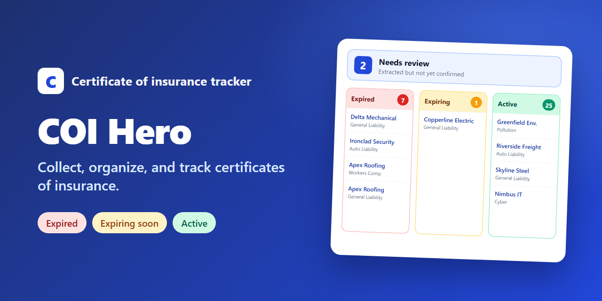
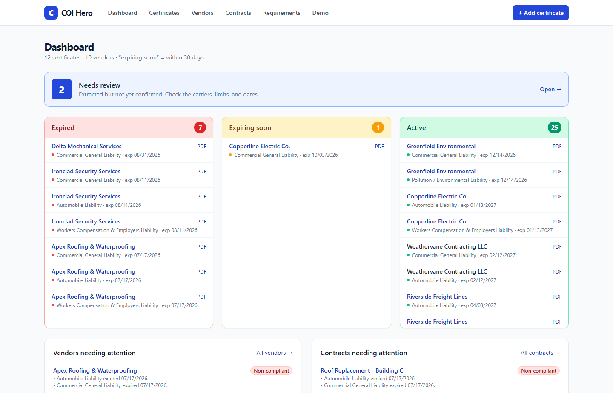
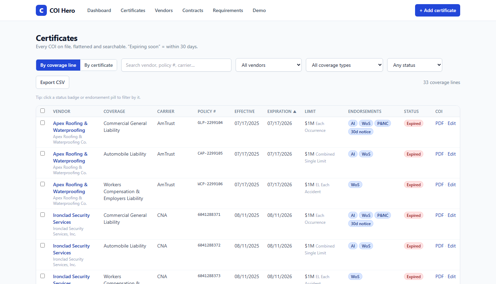
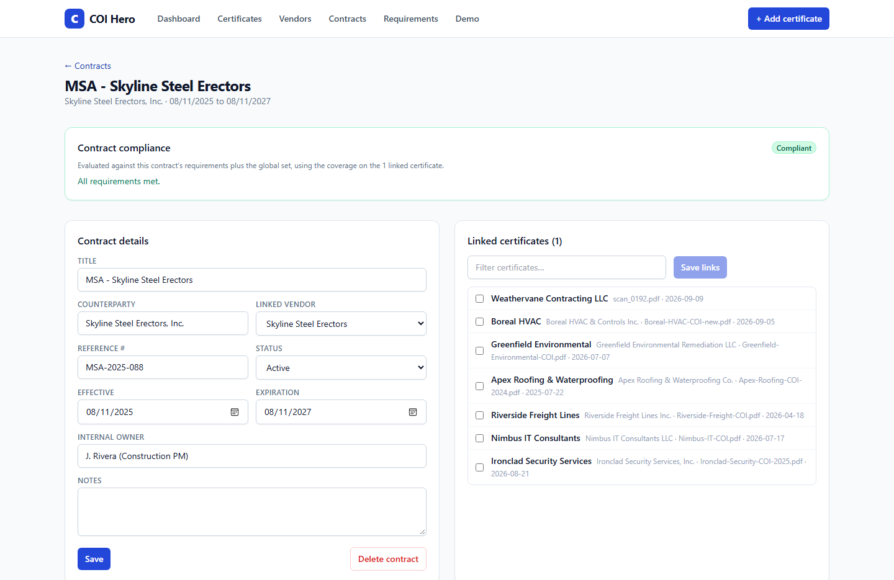

<p align="center">
  
</p>

# COI Hero

**Collect, organize, and track certificates of insurance.**

If you work in a business or a legal team, you are usually the one chasing certificates of insurance (COIs) from vendors and counterparties. They arrive as PDFs in email, get saved to a folder, and are never tagged, checked, or searchable again. COI Hero fixes that. Drop a COI in, and it stores the original, reads the key data off the form, and adds it to one searchable table. It then watches for expirations and checks coverage against the requirements in your contracts.

> **Status:** early, local-first prototype. It runs on your own machine with a local SQLite database and has **no authentication**, so do not expose it to the internet. Always confirm extracted values against the original PDF before relying on them. This is a tracking aid, not legal or insurance advice.

## Screenshots

| Dashboard | Certificates |
|---|---|
|  |  |

| Contract compliance |
|---|
|  |

## Features

- **Ingest.** Drag and drop (or browse for) one or many COI PDFs, or PNG/JPG scans. Email ingestion is planned; each certificate already records its `source`.
- **Extract.** Each file is read by Claude and turned into structured fields: producer, insured, certificate holder, insurers, description of operations, and per coverage line the type, carrier, policy number, effective and expiration dates, limits, additional insured, waiver of subrogation, primary and non-contributory, per-project aggregate, and notice of cancellation. You can edit anything on a review screen beside the PDF.
- **Organize.** One searchable, sortable table with two views: by coverage line and by certificate. Filter by vendor, coverage type, or status, or click any status badge or pill to filter by it. Bulk actions and CSV export included. Every row links back to the original PDF.
- **Track.** Per-coverage status (active, expiring soon, expired) with a configurable "expiring soon" window. The dashboard shows a "needs review" bar over three columns: red for expired, yellow for expiring, green for active.
- **Digest.** One page (`/digest`) listing, per vendor, every coverage line that is expired or inside the "expiring soon" window plus any compliance gaps (missing coverage, under-limit, missing additional insured or waiver of subrogation), earliest expiration first, with days remaining or overdue. **Download digest** exports the same rows as CSV.
- **Vendors.** Certificates group automatically under a vendor, matched from the insured name, with a compliance view per vendor.
- **Contracts.** Create a contract, give it its own insurance requirements (optionally on top of your global ones), link the certificates you collected for it, and get a live "compliant with this contract" flag.
- **Requirements.** Global minimum limits plus per-vendor and per-contract overrides. Coverage that is missing, expired, under-limit, or missing additional-insured or waiver-of-subrogation is flagged.
- **Demo mode.** Load a realistic sample dataset with one click, and optionally mock extraction so you can try everything without an API key.

## Quick start

Requires Node.js 20 or newer.

```bash
git clone https://github.com/nkostelnik/coi-hero.git
cd coi-hero
npm install
cp .env.local.example .env.local   # then add your ANTHROPIC_API_KEY
npm run dev
```

Open <http://localhost:3100>.

### Try it without an API key

Open **/demo** (or use the empty-state button on the dashboard) and click **Load sample data**. You get about 10 vendors, 12 certificates, and 3 contracts, with generated stand-in PDFs and a spread of statuses (active, expiring, expired, under-limit, missing coverage).

To also try the upload flow offline, set `COI_DEMO_MODE=1` in `.env.local` and restart. Any PDF you drop in then gets realistic mock fields generated from its file name instead of a real reading. `/demo` also has **Reset** and **Clear all data**.

### Real extraction

COI Hero calls the Anthropic API from the server to read each document. Create a key in the [Anthropic Console](https://console.anthropic.com/) and put it in `.env.local`:

```
ANTHROPIC_API_KEY=sk-ant-...
COI_EXTRACT_MODEL=claude-sonnet-5   # optional; use a larger model for messy scans
```

Restart the dev server after changing `.env.local`. Without a key the app still runs: files are stored and you enter the fields by hand (or add a key later and use **Re-run extraction** on a certificate). Documents you upload are sent to Anthropic for processing, so apply the same judgment you would for any third-party service.

## How it works

1. Upload stores the original file under `data/files/` and creates a certificate row.
2. The file is sent to Claude, which returns structured JSON that is normalized into coverage lines.
3. Everything lands in SQLite. Pages read the database directly; the browser calls JSON routes under `/api` for writes.
4. Status and compliance are computed on read from the dates and your requirements, so changing a rule updates every flag immediately.

## Project layout

```
src/
  app/                  Next.js App Router pages and API routes
    page.tsx            Dashboard
    certificates/       Table (both views) and per-certificate editor
    vendors/            List and vendor detail
    contracts/          List and contract detail (requirements, links, compliance)
    digest/             Expiring and expired coverage plus compliance gaps, per vendor
    requirements/       Global and per-vendor limit rules
    upload/             Drag-and-drop ingest
    demo/               Sample-data controls
    api/                certificates, contracts, vendors, requirements, files, digest, demo
  components/           UI (tables, editors, uploader)
  lib/
    db.ts               SQLite access, schema, and migrations
    extract.ts          Anthropic call, normalization, and demo-mode mock
    compliance.ts       Status and requirement evaluation
    digest.ts           Builds the expiration digest from the status and compliance logic
    dates.ts            Loose date parsing and status calculation
    ingest.ts           Store file, create row, extract
    demoData.ts         Sample vendors, certificates, and contracts
    demoSeed.ts         Builds the sample dataset
    samplePdf.ts        Zero-dependency PDF writer for the sample COIs
data/                   SQLite database and stored PDFs (git-ignored)
docs/                   Screenshots and the social preview image
```

## Tech stack

Next.js (App Router), React, TypeScript, Tailwind CSS, better-sqlite3, and the Anthropic SDK. One process and no external services beyond the Anthropic API.

## Data and privacy

Your database and uploaded PDFs live in `data/` on your machine and are git-ignored. `.env.local` (which holds your API key) is also git-ignored. Delete `data/` to reset everything.

## Roadmap

- Email ingestion: forward a COI to an inbox and have it land in the table.
- Authentication and multi-user support.
- Renewal reminders and "request an updated COI" email drafts.
- A per-certificate compliance view that also checks endorsement fields such as primary and non-contributory and minimum notice days.
- Hosting with a persistent disk (or a hosted database and object storage) so it can run beyond a single machine.

## License

No license has been chosen yet, so all rights are reserved by default.
